## Angular component outliner

Are you tired of trying to navigate the complex component hierarchy of your Angular application? Look no further than Angular Outliner!

This browser extension allows you to easily visualize the component tree of your Angular application, making it simple to understand the structure and relationships of your components. With just one click, you can activate the extension and see a clear representation of your application's components in a sidebar.

When it comes to code review, Angular Outliner can also be a powerful tool. It allows developers to quickly understand the component hierarchy of the new code increment, making it easier to identify potential issues, bugs and conflicts with the existing codebase. This makes code reviews more efficient and effective, saving you time and effort.

Don't let a complex component hierarchy slow you down. Try Angular Outliner today and see how it can make understanding and working with your Angular application a breeze, and make your code reviews more efficient.

____

Chrome extension that helps to visualise application components by drawing a border around them.

You can choose between component namespaces defined by prefix (e.g. `app` - application components, `mat` - angular material components, etc.) or specific components.


There are a few options to choose from: class name or selector and label position.

It is possible to filter by component name.
A number in brackets after the component name shows the number of instances of the given component.

##### Angular application
Must be started in [development mode](https://stackoverflow.com/a/67686819/4420532) (`ng` is available in chrome console).

##### Examples


Chrome Extension [YouTube](https://youtu.be/NUdmr3CRHuE)

#### Mermaid
The extension also generates a Mermaid Flowchart diagram of the components. It highlights the components with OnPush strategy.

[Mermaid](https://mermaid-js.github.io/mermaid/#/flowchart?id=graph)

```mermaid
flowchart TD
classDef onPushClass fill:#095,stroke:#333,stroke-width:4px;
AppComponent-0[AppComponent]-->MatCard-1[MatCard]
 MatCard-1[MatCard]-->MatCardHeader-2[MatCardHeader]
 MatCard-1[MatCard]-->MatButton-3[MatButton]
 MatCard-1[MatCard]-->MatButton-4[MatButton]
AppComponent-0[AppComponent]-->MatCard-5[MatCard]
 MatCard-5[MatCard]-->MatCardHeader-6[MatCardHeader]
  MatCardHeader-6[MatCardHeader]-->MatIcon-7[MatIcon]
 MatCard-5[MatCard]-->MatList-8[MatList]
  MatList-8[MatList]-->MatListItem-9[MatListItem]
  MatList-8[MatList]-->MatListItem-10[MatListItem]
  MatList-8[MatList]-->MatListItem-11[MatListItem]
 MatCard-5[MatCard]-->MatList-12[MatList]
  MatList-12[MatList]-->MatListItem-13[MatListItem]
  MatList-12[MatList]-->MatListItem-14[MatListItem]
AppComponent-0[AppComponent]-->MatCard-15[MatCard]
 MatCard-15[MatCard]-->MatCardHeader-16[MatCardHeader]
  MatCardHeader-16[MatCardHeader]-->MatIcon-17[MatIcon]
 MatCard-15[MatCard]-->MatSlider-18[MatSlider]
 MatCard-15[MatCard]-->MatSlider-19[MatSlider]
 MatCard-15[MatCard]-->MatSlider-20[MatSlider]
 MatCard-15[MatCard]-->MatProgressBar-21[MatProgressBar]
AppComponent-0[AppComponent]-->MatCard-22[MatCard]
 MatCard-22[MatCard]-->ParentComponent-23[ParentComponent]
  ParentComponent-23[ParentComponent]-->ChildComponent-24[ChildComponent]
  ParentComponent-23[ParentComponent]-->ChildComponent-25[ChildComponent]
  ParentComponent-23[ParentComponent]-->ChildComponent-26[ChildComponent]
class MatCard-1,MatCardHeader-2,MatButton-3,MatButton-4,MatCard-5,MatCardHeader-6,MatIcon-7,MatList-8,MatListItem-9,MatListItem-10,MatListItem-11,MatList-12,MatListItem-13,MatListItem-14,MatCard-15,MatCardHeader-16,MatIcon-17,MatSlider-18,MatSlider-19,MatSlider-20,MatProgressBar-21,MatCard-22 onPushClass
```


## Installation

- Clone the repository
- Run `npm install`
- Run `npm run start` 
- Open `chrome://extensions/` in your browser and drag and drop the `dist` folder.


##### Description
The extension is intended for Angular developers. It works in Angular development mode on port 4200. The rendering engine has to be IVY.

Once installed, it should be pinned for easy access.

Let's say I'm a new developer on a project and I want to see what components are on the page and how they are organised. The extension
extension allows me to highlight components and instantly see their boundaries.

Or maybe I am preparing a pull request and want to illustrate the solution. I can take a screenshot of the page with the components involved and attach it to the pull request.

The components can be highlighted by prefix - say I want to see all material components - they have the prefix MAT.

Or maybe I am interested in custom application components - they have the prefix APP.
Some components may overlap.

The other way to highlight a component is to select individual components by name. For example, I want to see ....

I can toggle the table to show component selectors instead of names.

If there are many components on the page, I can use filters. Found components are automatically highlighted.

The extension also shows the number of component instances and the change detection strategy.

For better experience it is recommended to use display block on all components. I can set default display option for new components in angular.json when using CLI.
```json
{
  "schematics": {
    "@schematics/angular:component": {
      "displayBlock": true
    }
  }
}
```

#### Tags
\#Angular \#ChromeExtension

<!--
The source code can be found on github.
-->


